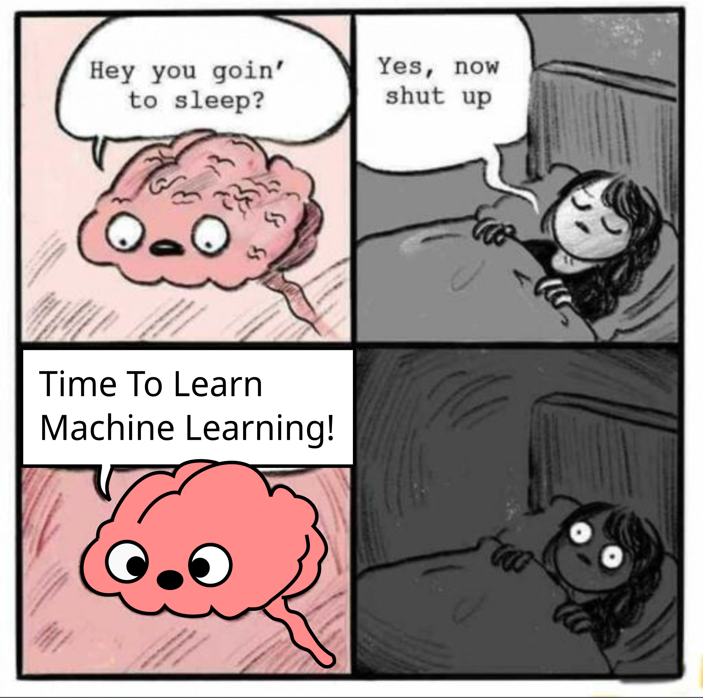

# learning-machine

**[Strait forward machine learning based on answers and intuition for machine learners](https://rentruewang.github.io/learning-machine)**

**This handbook accompanies the course: [Machine Learning with Hung-Yi Lee](https://speech.ee.ntu.edu.tw/~hylee/ml/2021-spring.html)**

_**Whoever fights monsters should see to it that in the process he does not become a monster. And if you gaze long enough into an abyss, the abyss will gaze back into you. And in order to tame machine learning, one mush first know how to learn machine.**_
--- Me, 2021

## Where does the logo come from?

The logo is made with Inkscape and the following meme.

## Why this book?

There are many resources for machine learning on the internet. However, most of them are either

1. Too long. It takes half an hour just to read through.

2. Too math heavy. It takes you forever to understand.

3. Too confusing. The concepts are not strait-forward.

This book aims to solve all of that. It tries to be as concise but easy to grasp as possible.

## Who is this book for?

This book is for learners who want to quickly grasp an idea, without diving deep into a topic (it takes way too long!). The book is a handbook for people who want to preserve their time.

## Disclaimer

This book assumes that you have at least some basic understanding of programming.

## Index

- ### [Getting Started](./book/basics/basics.ipynb)
  - [Data](./book/basics/data/data.ipynb)
  - [Model](./book/basics/model/model.ipynb)
  - [Loss Function](./book/basics/loss/loss.ipynb)
  - [Approximation](./book/basics/approx/approx.ipynb)
  - [Gradients](./book/basics/gradients/gradients.ipynbdients)
    - [Loss Function Derivative](./book/basics/gradients/loss-fn-derivative.ipynb)
    - [Back Propagation](./book/basics/gradients/back-prop.ipynb)
- ### [Common Tasks](./book/tasks/tasks.ipynb)
  - [Regression](./book/tasks/regression/regression.ipynb)
  - [Auto Regression](./book/tasks/regression/regression.ipynb)
  - [Classification](./book/tasks/classification/classification.ipynb)
- ### [Common Building Blocks](./book/layers/layers.ipynb)
  - [Linear](./book/layers/linear/linear.ipynb)
    - [Linear Layers' Gradients](./book/layers/linear/linear-grad.ipynb)
  - [Convolution](./book/layers/cnn/cnn.ipynb)
  - [Recurrent](./book/layers/rnn/rnn.ipynb)
    - [LSTM](./book/layers/rnn/lstm/lstm.ipynb)
    - [GRU](./book/layers/rnn/gru/gru.ipynb)
  - [Embedding](./book/layers/emb/emb.ipynb)
  - [Dropout](./book/layers/dropout/dropout.ipynb)
  - [Normalization](./book/layers/norm/norm.ipynb)
  - [Padding](./book/layers/padding/padding.ipynb)
  - [Pooling](./book/layers/pooling/pooling.ipynb)
  - [Transformer](./book/layers/transformer/transformer.ipynb)
    - [Attention](./book/layers/transformer/attn/attn.ipynb)
    - [Self Attention](./book/layers/transformer/attn/self-attn.ipynb)
    - [Versus RNN](./book/layers/transformer/transformer-vs-rnn.ipynb)
    - [Training](./book/training/../layers/transformer/training/training.ipynb)
    - [Teacher Forcing](./book/layers/transformer/training/teacher/teacher.ipynb)
    - [Tokenization](./book/layers/transformer/training/token/token.ipynb)
    - [Without Training](./book/layers/transformer/training/no-training/no-training.ipynb)
  - [Activation](./book/layers/activation/activation.ipynb)
    - [ReLU](./book/reinforce/value-based/q-learning.ipynb)
    - [Sigmoid](./book/layers/activation/sigmoid/sigmoid.ipynb)
    - [Softmax](./book/layers/activation/softmax/softmax.ipynb)
    - [Tanh](./book/layers/activation/tanh/tanh.ipynb)
- ### [Frequently Encountered Issues](./book/issues/issues.ipynb)
  - [Batch Size](./book/issues/batch/batch.ipynb)
  - [Gradient Norm](./book/issues/gradient/norm.ipynb)
  - [Saddle Point](./book/issues/gradient/saddle.ipynb)
  - [Learning Rate](./book/issues/lr/lr.ipynb)
  - [Overfit](./book/issues/data/overfit.ipynb)
  - [Underfit](./book/issues/data/underfit.ipynb)
- ### [Generative Models](./book/generative/generative.ipynb)
  - [Auto Encoder](./book/generative/ae/ae.ipynb)
    - [Architecture](./book/generative/ae/ae-arch.ipynb)
    - [Semi Supervised](./book/generative/ae/ae-semi.ipynb)
    - [Variational](./book/generative/ae/vae/vae.ipynb)
  - [Generative Adversarial Networks](./book/generative/gan/gan.ipynb)
  - [Gaussian Mixture Models](./book/generative/gmm/gmm.ipynb)
- ### [Improving Models](./book/better/better.ipynb)
  - [Explainable](./book/better/explainable/explainable.ipynb)
  - [Meta Learning](./book/better/meta/meta.ipynb)
  - [Life Long Learning](./book/better/lll/lll.ipynb)
  - [Compression](./book/better/compression/compression.ipynb)
- ### [Reuse Existing Models](./book/reuse/reuse.ipynb)
  - [Domain Adaptation](./book/reuse/da/da.ipynb)
  - [Transfer Learning](book/reuse/transfer/transfer.ipynb)
  - [Knowledge Distillation](book/reuse/distil/distil.ipynb)
- ### [Beyond Supervised Training](./book/unsupervised/unsupervised.ipynb)
  - [Clustering](./book/unsupervised/clustering/clustering.ipynb)
  - [Decision Tree](book/unsupervised/decision-tree/decision-tree.ipynb)
  - [Self Supervised](book/unsupervised/self-supervised/self-supervised.ipynb)
  - [Semi Supervised](book/unsupervised/semi-supervised/semi-supervised.ipynb)
- ### [Reinforcement Learning](./book/reinforce/reinforce.ipynb)
  - [State](./book/reinforce/essential/state.ipynb)
  - [Agent](./book/reinforce/essential/agent.ipynb)
  - [Action](./book/reinforce/essential/action.ipynb)
  - [Reward](./book/reinforce/essential/reward.ipynb)

## Contributing

We take openness and inclusiveness very seriously. We have adopted the following code of conduct.

[Contributor code of conduct](CODE_OF_CONDUCT.md)
